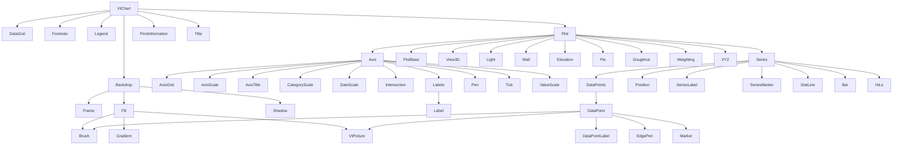

# HWP 차트 스펙 분석 - `hwp-chart-revision1.2.pdf`

- 원문 PDF: `/Users/shinehandmac/Downloads/한글문서파일형식_차트_revision1.2.pdf`
- 저장소 사본: `/Users/shinehandmac/Github/TotalDocs/docs/hwp-spec/hwp-chart-revision1.2.pdf`
- 판본: revision 1.2:20141120
- 페이지 수: PDF 47쪽, 본문 인쇄 페이지 1-40
- 범위: HWP 2002 이후 제품에서 사용하는 차트 바이너리 구조
- 목적: 파서, 객체 트리, 렌더러, 저장기, 회귀 테스트 설계에 바로 쓸 수 있는 구현 기준서

## 1. 문서 개요

이 문서는 HWP 차트 형식을 "COM 스타일 속성 카탈로그"와 "재귀적인 `ChartObj` 직렬화 포맷"이 결합된 구조로 설명한다. 구현 관점에서 중요한 점은 다음 다섯 가지다.

- 차트 스트림은 `ChartObj`들이 순차적으로 저장되는 구조이며, 각 `ChartObjData` 내부에 또 다른 `ChartObj`가 재귀적으로 들어갈 수 있다.
- 루트는 `VtChart` 하나이며, 실제 시각 결과는 `Plot`, `Axis`, `Series`, `Legend`, `Title`, `Footnote`, `PrintInformation` 조합으로 결정된다.
- 스펙의 상당수 필드는 화면 렌더뿐 아니라 편집기 상태, 스프레드시트 링크, 인쇄 레이아웃, 3D 시점까지 포함한다. 즉 "지금 당장 안 쓰는 필드"도 저장 시 버리면 안 된다.
- 일부 표에는 타입/상수 참조 모순이 존재한다. 따라서 enum을 사람이 이해한 이름으로만 보관하면 round-trip 안정성이 깨질 수 있다.
- 브러시 패턴, 마커, 펜 스타일처럼 PDF가 아이콘 위주로 제시하는 상수군은 텍스트 이름이 불완전하므로 raw 원값 보존이 특히 중요하다.

참고 문서와의 역할 분담은 다음과 같다.

- `README.md`: 분석 문서 공통 작성 규칙
- `spec-crosswalk.md`: 차트 문서가 전체 HWP 엔진에서 맡는 위치
- `implementation-requirements.md`: 차트 파서를 프로젝트 구현 우선순위에 연결한 통합 기준

## 2. 형식 범위와 버전

- 대상 문서: `Hwp Document File Formats - Charts`, revision 1.2:20141120
- 적용 범위: HWP 2002 이후 제품의 차트 바이너리 형식
- 제외 범위: 일반 HWP 5.0 레코드, HWPML, 수식, 배포용 문서
- 표현 방식: `ChartObj` 직렬화 + object/collection/property 표 + constants 표

원문은 본문 앞에 저작권/목차 페이지가 있어, PDF 쪽수와 인쇄 쪽수가 다르다. 구현자 관점 재참조 시에는 아래처럼 보는 편이 편하다.

- PDF 8쪽 = 본문 2쪽 = `1. Chart Object의 기본 구조`
- PDF 9쪽 = 본문 3쪽 = `2. Chart Object의 Tree 구조`
- PDF 10-29쪽 = 본문 4-23쪽 = `3. Chart Object`
- PDF 30-45쪽 = 본문 24-39쪽 = `4. Constants 자료형`

## 3. `ChartObj` 저장 모델

### 3.1 최상위 레코드 구조

원문 1장 그림에 따르면 각 `ChartObj`는 다음 고정/가변 구조를 가진다.

| 구성요소 | 원문 표기 | 구현 해석 | 저장 시 주의 |
|---|---|---|---|
| `id` | `long` | 개별 객체 엔트리 식별값으로 보이나 본문에서 의미 설명이 부족하다 | 의미를 추론해서 바꾸지 말고 raw `long` 그대로 보존 |
| `StoredtypeID` | `long` | 객체 타입 식별자. 실제 디스패치 키 | 파서/저장기 모두 raw 값 유지 |
| `StoredName` | `char*` | 타입 이름 문자열 | `VariableData`에 포함되며 중복 타입 뒤에서는 생략 가능 |
| `StoredVersion` | `int` | 해당 타입의 저장 버전 | `StoredName`과 같은 생략 규칙을 따른다 |
| `ChartObjData` | `chartObject` | 현재 객체의 payload. 다른 `ChartObj`를 포함할 수 있다 | 하위 객체 파싱 순서를 보존해야 한다 |
| `VariableData` | 도식상 `StoredName + StoredVersion` | 동일 `StoredtypeID`가 앞서 등장한 경우 생략되는 가변 영역 | 입력 시 "존재 여부"를 별도로 기록하고 그대로 재방출하는 것이 안전 |

원문에 명시된 핵심 규칙:

- `StoredName`과 `StoredVersion`은 `VariableData`이다.
- 같은 `StoredtypeID`가 중복 등장하면 뒤쪽 `ChartObj`에서는 `VariableData`가 제외될 수 있다.
- `ChartObjData`는 또 다른 `ChartObj`를 포함할 수 있다.

### 3.2 재귀 파서 설계

이 스펙은 단순 flat record 목록이 아니다. 안전한 구현은 "직렬화 순서 보존"과 "재귀 하강 파싱"을 동시에 만족해야 한다.

권장 파서 흐름:

1. `id`, `StoredtypeID`를 읽는다.
2. 현재 직렬화 컨텍스트에서 해당 `StoredtypeID`의 `VariableData`가 이번 노드에 실제로 존재하는지 확인한다.
3. 존재하면 `StoredName`, `StoredVersion`을 읽고 type dictionary에 기록한다.
4. `StoredtypeID`로 payload parser를 디스패치한다.
5. payload 내부에서 object 타입 필드를 만나면 선언 순서대로 하위 `ChartObj`를 다시 읽는다.
6. collection 타입이면 `Count`와 `Item` 순서를 보존한다.
7. 알 수 없는 객체/필드/enum은 opaque raw로 저장하고 재직렬화한다.

권장 의사코드:

```text
parseChartObj(stream, ctx):
  node.idRaw = readLong(stream)
  node.storedTypeIdRaw = readLong(stream)

  if hasVariableData(stream, ctx, node.storedTypeIdRaw):
    node.variableDataPresent = true
    node.storedNameRaw = readCString(stream)
    node.storedVersionRaw = readInt(stream)
    ctx.typeInfo[node.storedTypeIdRaw] = (node.storedNameRaw, node.storedVersionRaw)
  else:
    node.variableDataPresent = false
    node.storedNameRaw, node.storedVersionRaw = ctx.typeInfo.get(node.storedTypeIdRaw)

  node.payload = parsePayloadByType(node.storedTypeIdRaw, stream, ctx)
  return node
```

주의:

- `VariableData` 생략 범위가 "전체 스트림", "같은 부모의 child sequence", "타입별 local block" 중 무엇인지 원문이 엄밀히 적지 않는다.
- 따라서 round-trip 구현에서는 "입력 당시 이 노드에 variable data가 실제 있었는지"를 노드별 비트로 보존하는 방식이 가장 안전하다.
- 새 차트를 생성하는 경로에서는 "직렬화 순서상 첫 등장만 `StoredName`/`StoredVersion` 포함" 규칙을 따르되, 기존 문서 편집 경로와 분리하는 편이 좋다.

### 3.3 메모리 모델 권장 항목

차트 노드는 최소한 아래 정보를 따로 들고 있어야 한다.

| 필드 | 이유 |
|---|---|
| `idRaw` | 의미 미상 필드의 원값 보존 |
| `storedTypeIdRaw` | 디스패치와 round-trip의 기준 |
| `variableDataPresent` | 중복 타입 시 생략 규칙 복원 |
| `storedNameRaw`, `storedVersionRaw` | 타입 메타 복원 |
| `payloadRaw` 또는 unknown field blob | 해석 실패 시에도 저장 가능 |
| `children[]` | 재귀 구조와 순서 보존 |
| `enumRaw[fieldName]` | 미정의 enum 값 보존 |
| `decoded[fieldName]` | 렌더러/에디터가 쓰는 해석 결과 |
| `ownerPath` | `VtChart/Plot/Series[2]/DataPoint[5]` 같은 디버깅 경로 |

### 3.4 스펙 모호점과 구현 지침

원문 PDF를 다시 보면 몇 군데는 표 자체에 모순이 있다. 아래 항목은 구현 시 그대로 적어 두는 편이 좋다.

| 위치 | 원문 내용 | 구현 지침 |
|---|---|---|
| `3.9 AxisScale.PercentBasis` | 자료형이 `String`인데 의미는 `4.26 PercentAxisBasis Constants`와 연결된다 | 문자열/정수 어느 쪽으로 읽혔는지 raw를 따로 보존하고, 해석 값은 별도 필드로 둔다 |
| `3.39 Location.LocationType` | 설명이 `LabelLocationType` 상수를 가리킨다 | `4.22 LocationType`도 별도 존재하므로 owner context에 따라 해석하되 raw int는 무조건 유지 |
| `3.44 Plot.Doughnut` | 자료형이 `Coor Object`로 기재되어 있다 | `3.24 Doughnut Object`와 상충하므로 field name, child `StoredtypeID`, raw payload를 모두 보존한다 |
| `3.44 Plot.Pie` | 자료형이 `Wall Pie Object`로 적혀 있다 | `3.43 Pie Object`, `3.61 Wall Object`와 혼재된 표기다. 저장 시 원래 child sequence를 기준으로 round-trip 한다 |
| `3.44 Plot.Series` vs `3.49 SeriesCollection Collection` | `Plot` 표에는 단수 `Series Object`, 본문에는 `SeriesCollection` 절도 존재 | parser는 반복 `Series`와 wrapper collection을 모두 허용해야 한다 |
| `3.50 Series.ShowGuideLines` | 설명 말미가 `AxisId` 상수를 참조한다 | boolean 필드이므로 enum으로 해석하지 말고 원문 텍스트만 참고한다 |
| `4.5/4.6/4.23/4.29` | `BrushPatterns`, `BrushHatches`, `MarkerStyle`, `PenStyle`는 텍스트보다 도형/아이콘 비중이 크다 | symbolic name보다 raw 값 보존을 우선한다 |

## 4. 객체 트리와 재귀 구조

### 4.1 원문에 직접 나온 루트 트리

원문 2장은 루트 `VtChart`에서 시작하는 1차 자식만 직접 보여 준다.

- `Backdrop`
- `DataGrid`
- `Footnote`
- `Legend`
- `Plot`
- `PrintInformation`
- `Title`

이 도식은 "전체 객체 그래프"가 아니라 "루트에서 직접 매달린 객체"만 보여 준다. 실제 구현은 각 객체 표의 자료형을 따라 더 깊이 내려가야 한다.

### 4.2 구현용 부모-자식 재귀 맵

아래 표는 객체 표를 다시 따라가며 만든 구현용 containment map이다.

| 부모 객체 | 직접 하위 객체/컬렉션 | 구현 메모 |
|---|---|---|
| `VtChart` | `Backdrop`, `DataGrid`, `Footnote`, `Legend`, `Plot`, `PrintInformation`, `Title` | 루트 차트 하나를 표현 |
| `Plot` | `Axis`, `Backdrop`, `Doughnut`, `Elevation`, `Light`, `Pie`, `PlotBase`, `Series`, `View3D`, `Wall`, `Weighting`, `XYZ` | 2D/3D/파이/도넛/산포를 모두 품는 중심 노드 |
| `Axis` | `AxisGrid`, `AxisScale`, `AxisTitle`, `CategoryScale`, `DateScale`, `Intersection`, `Labels`, `Pen`, `Tick`, `ValueScale` | 축별 스케일과 텍스트, 교차점까지 포함 |
| `Labels Collection` | `Label[]` | 축 레이블 레벨 순서를 보존해야 한다 |
| `Series` | `Bar`, `DataPoints`, `GuidelinePen`, `HiLo`, `Pen`, `Position`, `SeriesLabel`, `SeriesMarker`, `StatLine` | 렌더러가 가장 많이 참조하는 노드 |
| `DataPoints Collection` | `DataPoint[]` | 개별 포인트 override 보존 |
| `DataPoint` | `Brush`, `DataPointLabel`, `EdgePen`, `Marker`, `VtPicture` | 포인트 단위 스타일/라벨/그림 |
| `DataPointLabel` | `Backdrop`, `Offset`, `TextLayout`, `VtFont` | 텍스트 자체와 위치, formatting 모두 별도 보존 |
| `SeriesLabel` | `Backdrop`, `Offset`, `TextLayout`, `VtFont` | 계열 레이블용 텍스트 프레임 |
| `Title` | `Backdrop`, `Location`, `TextLayout`, `VtFont` | 실제 문자열은 `Title.Text`, 루트에도 `TitleText` 중복 존재 |
| `Footnote` | `Backdrop`, `Location`, `TextLayout`, `VtFont` | 루트 `FootnoteText`와 child `Text` 중복 보존 필요 |
| `Legend` | `Backdrop`, `Location`, `TextLayout`, `VtFont` | 표시 여부는 `VtChart.ShowLegend`, 텍스트는 `Series.LegendText`에서 온다 |
| `AxisTitle` | `Backdrop`, `TextLayout`, `VtFont` | 축 제목용 텍스트 프레임 |
| `Label` | `Backdrop`, `TextLayout`, `VtFont` | 축 레이블 공통 속성 |
| `Backdrop` | `Frame`, `Fill`, `Shadow` | 배경 박스 스타일 공통 래퍼 |
| `Fill` | `Brush`, `Gradient`, `VtPicture` | 채우기 방식 분기 |
| `Marker` | `Pen`, `VtPicture`, `FillColor` | point marker 시각 요소 |
| `Light` | `LightSources` | 3D 광원 집합 |
| `LightSources Collection` | `LightSource[]` | 광원 순서 보존 |
| `Elevation` | `Attributes`, `Contour`, `ContourGradient`, `Surface` | 3D 상승/등고선 계열 핵심 |
| `Attributes Collection` | `Attribute[]` | contour band/line 정보 |

### 4.3 구현용 트리 요약



### 4.4 재귀 해석 시 꼭 지켜야 할 규칙

- object 필드는 "값이 객체형이라는 뜻"이지, visible 상태와 동일하지 않다. `Visible = false`라도 객체 노드 자체는 저장되어 있을 수 있다.
- collection은 `Count`와 `Item` 순서를 그대로 보존해야 한다. `DataPoint`, `Label`, `LightSource`, `Attribute`의 순서는 의미가 있다.
- 텍스트 프레임 계열(`Title`, `Footnote`, `Legend`, `AxisTitle`, `SeriesLabel`, `DataPointLabel`, `Label`)은 모두 `Backdrop`, `TextLayout`, `VtFont`를 공유하므로 공통 구조체로 뽑아두는 편이 좋다.
- `DataGrid`는 행/열 메타와 라벨만 직접 정의하고, 값 접근은 `VtChart.Data`와 `Column/Row` cursor 모델에 의존한다. 즉 단순 2차원 배열로 환원하기 전에 raw payload를 보존해야 한다.

## 5. 파서가 반드시 뽑아야 할 핵심 필드

### 5.1 `VtChart` 루트 요약

`VtChart`는 실제 렌더 필드와 편집 상태 필드를 함께 갖는다.

| 필드 | 자료형 | 분류 | 구현 메모 |
|---|---|---|---|
| `ActiveSeriesCount` | `Integer` | data-binding/state | 열 수와 차트 유형을 기준으로 표시되는 계열 수. 계산값처럼 보여도 raw 보존 |
| `AllowDithering` | `Boolean` | render-state | 색상 디더링 제어. 초기 렌더러가 안 써도 저장 시 유지 |
| `AllowDynamicRotation` | `Boolean` | 3d/editor | 3D 사용자 회전 허용 |
| `AllowSelections`, `AllowSeriesSelection`, `AllowUserChanges` | `Boolean` | editor-state | UI 기능 토글. serializer에서는 손실 금지 |
| `AutoIncrement` | `Boolean` | data-entry | `Data` 입력 시 `Column/Row` cursor 자동 증가 여부 |
| `Backdrop` | `Backdrop Object` | layout/style | 차트 전체 배경 |
| `Chart3d` | `Boolean` | 3d | 3D 파이프라인 분기 |
| `ChartType` | `Integer` | layout/enum | 전체 차트 유형. `4.7` raw enum 보존 |
| `Column`, `Row` | `Integer` | data-entry | 현재 데이터 요소 cursor |
| `ColumnCount`, `RowCount` | `Integer` | data-binding | `DataGrid`와 함께 보존 |
| `ColumnLabel`, `RowLabel` | `String` | data-binding/text | 현재 label cursor 또는 현재 요소 표시용 텍스트 |
| `ColumnLabelCount`, `RowLabelCount` | `Integer` | data-binding | label 레벨 수 |
| `ColumnLabelIndex`, `RowLabelIndex` | `Integer` | data-entry | 특정 label 레벨 선택 상태 |
| `Data` | `String` | data-binding | 현재 cursor 위치의 데이터 값. matrix 재구성 전에 raw 보존 |
| `DataGrid` | `DataGrid Object` | data-binding | grid 메타 |
| `DoSetCursor` | `Boolean` | editor-state | 마우스 포인터 제어 여부 |
| `DrawMode` | `Integer` | render-state | 다시 그리기 모드. `4.11` |
| `ErrorOffset` | `Integer` | app-state | App 오류 번호 조정값 |
| `FileName` | `String` | external-link | 차트 로드/저장 이름 |
| `Footnote`, `FootnoteText` | object + `String` | text/layout | child object와 root string을 둘 다 보존 |
| `Handle`, `Picture` | `Long`/`Integer` | app-state | 외부 앱 연동 핸들 |
| `Legend` | `Legend Object` | layout/style | 범례 위치/폰트/배경 |
| `Plot` | `Plot Object` | layout/3d | 실제 플로팅 핵심 |
| `PrintInformation` | `PrintInformation Object` | print | 인쇄 전용이지만 손실 위험 큼 |
| `RandomFill` | `Boolean` | state | 데이터 격자 값이 임의 생성인지 |
| `Repaint` | `Boolean` | render-state | 변경 후 repaint 여부 |
| `SeriesColumn` | `Integer` | data-binding | 현재 계열 데이터 열 위치 |
| `SeriesType` | `Integer` | layout/enum | 현재 계열 표현 방식. `4.39` |
| `ShowLegend` | `Boolean` | layout | 범례 표시 gate |
| `SsLinkMode`, `SsLinkRange`, `SsLinkBook` | enum + `String` | data-binding/external-link | 스프레드시트 연결 |
| `Stacking` | `Boolean` | layout | 적층 여부 |
| `TextLengthType` | `Integer` | print/layout | 화면 최적화 vs 프린터 최적화 |
| `Title`, `TitleText` | object + `String` | text/layout | child object와 root string 중복 보존 |
| `TwipsWidth`, `TwipsHeight` | `Integer` | layout | 전체 캔버스 크기 |

### 5.2 `Axis` 계열 확장 필드 표

| 필드 | 자료형 / 원문 | 분류 | 구현/저장 메모 |
|---|---|---|---|
| `Axis.AxisGrid` | `AxisGrid Object` / 3.7 | layout/style | 주/부 격자선 객체에 대한 진입점 |
| `Axis.AxisScale` | `AxisScale Object` / 3.7 | layout | 스케일 종류를 먼저 보고 하위 값 해석 |
| `Axis.AxisTitle` | `AxisTitle Object` / 3.7 | text/layout | 축 제목 표시 여부와 텍스트 프레임 |
| `Axis.CategoryScale` | `CategoryScale Object` / 3.7 | layout | 범주 축 분할/레이블 간격 |
| `Axis.DateScale` | `DateScale Object` / 3.7 | layout | 날짜 축 최소/최대/간격 |
| `Axis.Intersection` | `Intersection Object` / 3.7 | layout | 다른 축과 만나는 위치 |
| `Axis.Labels` | `LabelsCollection` / 3.7 | text/layout | 레이블 레벨 집합. 순서 보존 |
| `Axis.LabelLevelCount` | `Integer` / 3.7 | text/layout | multi-level label 개수 |
| `Axis.Pen` | `Pen Object` / 3.7 | style | 축선 스타일 |
| `Axis.Tick` | `Tick Object` / 3.7 | layout | 눈금 길이/위치 |
| `Axis.ValueScale` | `ValueScale Object` / 3.7 | layout | 값 축 자동/수동 범위 |
| `AxisGrid.MajorPen` | `Pen Object` / 3.8 | layout/style | 주 격자선 |
| `AxisGrid.MinorPen` | `Pen Object` / 3.8 | layout/style | 부 격자선 |
| `AxisScale.Hide` | `Boolean` / 3.9 | layout | 축 숨김 플래그 |
| `AxisScale.LogBase` | `Integer` / 3.9 | layout/enum | `ScaleType=1`일 때만 의미 |
| `AxisScale.PercentBasis` | `String` / 3.9, `4.26` | layout/enum | 문서상 자료형 불일치. raw 문자열/정수 보존 |
| `AxisScale.Type` | `Integer` / 3.9, `4.38` | layout/enum | 선형/로그/백분율 축 분기 키 |
| `AxisTitle.Backdrop` | `Backdrop Object` / 3.10 | text/style | 제목 뒤 배경 |
| `AxisTitle.Text` | `String` / 3.10 | text | 실제 축 제목 |
| `AxisTitle.TextLayout` | `TextLayout Object` / 3.10 | text/layout | 방향, 정렬, wrap |
| `AxisTitle.TextLength` | `Integer` / 3.10 | text/state | 길이 값. 계산해서 덮어쓰지 말 것 |
| `AxisTitle.Visible` | `Boolean` / 3.10 | layout | 제목 표시 여부 |
| `AxisTitle.VtFont` | `VtFont Object` / 3.10 | text/style | 축 제목 글꼴 |
| `CategoryScale.Auto` | `Boolean` / 3.14 | layout/auto-manual | 자동 배율 여부 |
| `CategoryScale.DivisionsPerLabel` | `Integer` / 3.14 | layout | 레이블 건너뛰기 간격 |
| `CategoryScale.DivisionsPerTick` | `Integer` / 3.14 | layout | 눈금 건너뛰기 간격 |
| `CategoryScale.LabelTick` | `Boolean` / 3.14 | layout | 레이블이 눈금 가운데 오는지 |
| `DateScale.Auto` | `Boolean` / 3.23 | layout/auto-manual | 날짜 축 자동 |
| `DateScale.MajFreq`, `DateScale.MajInt` | `Integer` / 3.23, `4.10` | layout | 주 간격 빈도와 간격 유형 |
| `DateScale.MinFreq`, `DateScale.MinInt` | `Integer` / 3.23, `4.10` | layout | 부 간격 빈도와 간격 유형 |
| `DateScale.Minimum`, `DateScale.Maximum` | `Double` / 3.23 | layout | 날짜 축 범위 |
| `DateScale.SkipWeekend` | `Boolean` / 3.23 | layout | 주말 생략 여부 |
| `Intersection.Auto` | `Boolean` / 3.31 | layout/auto-manual | 교차 위치 자동 |
| `Intersection.AxisId` | `Integer` / 3.31, `4.2` | layout/enum | 어느 축과 교차하는지 |
| `Intersection.Index` | `Integer` / 3.31 | layout | 같은 ID 축이 여러 개일 때 구분 |
| `Intersection.LabelsInsidePlot` | `Boolean` / 3.31 | layout | 레이블을 plot 안쪽으로 이동할지 |
| `Intersection.Point` | `Double` / 3.31 | layout/manual | 수동 교차 지점 |
| `Label.Auto` | `Boolean` / 3.33 | text/layout/auto-manual | 레이블 자동 회전 여부 |
| `Label.Format`, `Label.FormatLength` | `String` / 3.33 | text | 날짜/숫자 포맷 문자열 |
| `Label.Standing` | `Boolean` / 3.33 | text/layout | Y면 세움 여부 |
| `Label.TextLayout` | `TextLayout Object` / 3.33 | text/layout | 정렬/방향 |
| `Label.VtFont` | `VtFont Object` / 3.33 | text/style | 레이블 글꼴 |
| `Tick.Length` | `Single` / 3.57 | layout | 눈금 길이 |
| `Tick.Style` | `Integer` / 3.57, `4.3` | layout/enum | 없음/가운데/안쪽/바깥쪽 |
| `ValueScale.Auto` | `Boolean` / 3.59 | layout/auto-manual | 수동 범위 지정 여부의 기준 |
| `ValueScale.MajorDivision` | `Integer` / 3.59 | layout | 주 분할 수 |
| `ValueScale.MinorDivision` | `Integer` / 3.59 | layout/manual | 설정 시 `Auto=False`로 자동 전환 |
| `ValueScale.Minimum`, `ValueScale.Maximum` | `Double` / 3.59 | layout/manual | 설정 시 `Auto=False`로 자동 전환 |

### 5.3 `Plot` 계열 확장 필드 표

| 필드 | 자료형 / 원문 | 분류 | 구현/저장 메모 |
|---|---|---|---|
| `AngleUnit` | `Integer` / 3.44, `4.1` | layout/enum | 각도 단위. 파이/원추/방사형 해석에 영향 |
| `AutoLayout` | `Boolean` / 3.44 | layout/auto-manual | 자동 레이아웃 여부. 수동 rect와 같이 보존 |
| `Axis` | `Axis Object` / 3.44 | layout | 축 진입점 |
| `Backdrop` | `Backdrop Object` / 3.44 | style | 플롯 뒤 배경 |
| `BarGap` | `Single` / 3.44 | layout | 범주 내부 막대 간격 |
| `Clockwise` | `Boolean` / 3.44 | layout | 파이/도넛/원추/방사형 시계 방향 |
| `DataSeriesInRow` | `Boolean` / 3.44 | data-binding/layout | series를 행에서 읽는지 열에서 읽는지 |
| `DefaultPercentBasis` | `Integer` / 3.44, `4.26` | layout/enum | 백분율 축 기본 기준 |
| `DepthToHeightRatio` | `Single` / 3.44 | 3d/layout | 차트 깊이 비율 |
| `Doughnut` | `Coor Object` 표기 / 3.44, `3.24` | 3d/pie-family | 스펙 모호점. child object raw 보존 필수 |
| `Elevation` | `Elevation Object` / 3.44 | 3d/layout | 상승/등고선 계열 핵심 |
| `Light` | `Light Object` / 3.44 | 3d/style | 광원 |
| `LocationRect` | `Rect Object` / 3.44 | layout | 플롯 영역 bbox |
| `MaxBubbleToAxisRatio` | `Single` / 3.44 | layout | 풍선 최대 크기 |
| `Perspective` | `Coor3 Object` / 3.44 | 3d/layout | 시점 위치 및 거리 |
| `Pie` | `Wall Pie Object` 표기 / 3.44, `3.43` | 3d/pie-family | 스펙 모호점. field name과 child type 모두 보존 |
| `PlotBase` | `PlotBase Object` / 3.44 | 3d/style | 3D 차트 바닥면 |
| `Projection` | `Integer` / 3.44, `4.37` | 3d/enum | 원근/2.5D/정투영 분기 |
| `ScaleAngle` | `Single` / 3.44 | layout | 원추/방사형 배율 표시 위치 |
| `Series` | `Series Object` / 3.44 | layout/data | 실제 계열 그룹. 반복 child 또는 collection wrapper 가능성 염두 |
| `Sort` | `Integer` / 3.44, `4.42` | layout/enum | 파이/도넛 정렬 방향 |
| `StartingAngle` | `Single` / 3.44 | layout | 파이/도넛 시작각 |
| `SubPlotLabelPosition` | `Integer` / 3.44, `4.45` | layout/enum | subplot label 위치 |
| `UniformAxis` | `Boolean` / 3.44 | 3d/layout | 모든 값 축 단위 배율 일관성 |
| `View3D` | `View3D Object` / 3.44 | 3d/layout | 회전/상승 각도 |
| `Wall` | `Wall Object` / 3.44 | 3d/style | 3D 벽면 또는 2D 배경 |
| `WidthToHeightRatio` | `Single` / 3.44 | 3d/layout | 차트 폭 비율 |
| `Weighting` | `Weighting Object` / 3.44 | pie-family/layout | 다중 파이/도넛 상대 크기 |
| `xGap` | `Single` / 3.44 | layout | X축 분할 간 막대 공간 |
| `XYZ` | `XYZ Object` / 3.44 | 3d/layout | 3D XYZ 축 교차점 |
| `zGap` | `Single` / 3.44 | 3d/layout | Z축 분할 간 공간 |
| `PlotBase.Brush`, `PlotBase.Pen`, `PlotBase.BaseHeight` | object + scalar / 3.45 | 3d/style | 바닥면 채우기, 선, 높이 |
| `View3D.Elevation`, `View3D.Rotation` | `Single` / 3.60 | 3d/layout | 카메라 각도 |
| `Wall.Brush`, `Wall.Pen`, `Wall.Width` | object + scalar / 3.61 | 3d/style | 벽면 시각 표현 |
| `Weighting.Basis`, `Weighting.Style` | `Integer` / 3.62, `4.33-4.34` | pie-family/enum | 다중 파이 크기 기준과 적용 방식 |
| `XYZ.Automatic` | `Boolean` / 3.63 | 3d/auto-manual | `true`면 0교차점, `false`면 개별 intersection 사용 |
| `XYZ.xIntersection`, `yIntersection`, `zIntersection` | `Double` / 3.63 | 3d/manual | 설정 시 `Automatic=False`로 전환 |
| `Light.AmbientIntensity`, `EdgeIntensity`, `EdgeVisible` | scalar + bool / 3.36 | 3d/style | 3D 조명 밀도와 외곽선 |
| `Light.LightSources` | collection / 3.36-3.38 | 3d/style | 광원 배열 |
| `Elevation.Attributes` | collection / 3.25 | 3d/style | contour band 목록 |
| `Elevation.AutoValues` | `Boolean` / 3.25 | 3d/auto-manual | 자동 등고선 vs 사용자 정의 |
| `Elevation.ColorType` | `Integer` / 3.25, `4.9` | 3d/enum | 기본/gradient/custom contour 색 |
| `Elevation.ColSmoothing`, `RowSmoothing` | `Integer` / 3.25 | 3d/layout | surface smoothness |
| `Elevation.Contour`, `ContourGradient`, `Surface` | objects / 3.25 | 3d/style | 평면/등고선 표현 |
| `Elevation.SeparateContourData` | `Boolean` / 3.25 | data-binding | contour data 분리 여부 |
| `Surface.Base`, `DisplayType`, `Projection`, `RowWireframe`, `ColWireframe` | `Integer` / 3.55, `4.46-4.49` | 3d/enum | 평면 차트 기준/표시/투사/wireframe 방식 |
| `Surface.Brush`, `WireframePen` | objects / 3.55 | 3d/style | surface 채움 및 wireframe 선 |
| `Pie.ThicknessRatio`, `TopRadiusRatio` | `Single` / 3.43 | 3d/layout | 3D 파이 높이/상단 반지름 비율 |
| `Doughnut.Sides`, `InteriorRatio` | `Integer`, `Single` / 3.24 | 3d/layout | 도넛 측면 수와 내부 구멍 비율 |

### 5.4 `Series` 계열 확장 필드 표

| 필드 | 자료형 / 원문 | 분류 | 구현/저장 메모 |
|---|---|---|---|
| `Bar` | `Bar Object` / 3.50 | 3d/style | 3D 막대 면 수와 상단 비율 |
| `DataPoints` | `Object` / 3.50, `3.20` | data/style | 개별 포인트 override 집합 |
| `GuidelinePen` | `Pen Object` / 3.50 | layout/style | 설정 시 `ShowGuideLines=True`가 된다 |
| `HiLo` | `Object` / 3.50, `3.30` | finance/style | gain/loss 색상 |
| `LegendText` | `String` / 3.50 | text | 범례 항목 텍스트의 실제 소스 |
| `Pen` | `Pen Object` / 3.50 | layout/style | 설정 시 `ShowLine=True`가 된다 |
| `Position` | `Position Object` / 3.50 | layout | 숨김/제외/적층 순서 |
| `SecondaryAxis` | `Boolean` / 3.50 | layout | 보조 축 사용 여부 |
| `SeriesLabel` | `SeriesLabel Object` / 3.50 | text/layout | 계열 레이블 텍스트와 위치 |
| `SeriesMarker` | `SeriesMarker Object` / 3.50 | layout/style | 마커 자동 할당 여부 |
| `SeriesType` | `Integer` / 3.50, `4.39` | layout/enum | 계열 표현 방식 |
| `ShowGuideLines` | `Boolean` / 3.50 | layout | 가이드선 표시 여부 |
| `ShowLine` | `Boolean` / 3.50 | layout | 데이터 요소 연결선 표시 여부 |
| `SmoothingFactor` | `Integer` / 3.50 | layout | 부드럽게 하기 샘플링 정도 |
| `SmoothingType` | `Integer` / 3.50, `4.41` | layout/enum | spline 유형 |
| `StatLine` | `StatLine Object` / 3.50 | layout/style | 최소/최대/평균/표준편차/추세선 |
| `Position.Excluded` | `Boolean` / 3.46 | layout | 차트 포함 여부 |
| `Position.Hidden` | `Boolean` / 3.46 | layout | 표시 여부 |
| `Position.Order` | `Integer` / 3.46 | layout | 적층 여부에도 영향 |
| `Position.StackOrder` | `Integer` / 3.46 | layout | 적층 시 그려지는 순서 |
| `SeriesLabel.LocationType` | `Integer` / 3.51, `4.21` | layout/enum | 계열 레이블 위치 |
| `SeriesLabel.Offset` | `Coor Object` / 3.51 | layout | 표준 위치에서의 이동량 |
| `SeriesLabel.Text` | `String` / 3.51 | text | 기본값은 열 레이블과 같음 |
| `SeriesLabel.TextLayout`, `TextLength`, `VtFont`, `Backdrop` | objects + scalar / 3.51 | text/style | 텍스트 프레임 전체 |
| `SeriesMarker.Auto` | `Boolean` / 3.52 | layout/auto-manual | 자동 마커 지정 여부 |
| `SeriesMarker.Show` | `Boolean` / 3.52 | layout | 계열 마커 표시 |
| `StatLine.Flags` | `Integer` / 3.54, `4.44` | layout/enum | 표시할 통계 선 종류 |
| `StatLine.Style`, `Width`, `VtColor` | style fields / 3.54 | style | 통계선 시각 표현 |
| `Bar.Sides`, `TopRatio` | scalar / 3.12 | 3d/style | 3D 막대 모양 |
| `HiLo.GainColor`, `LossColor` | `VtColor` / 3.30 | finance/style | 상승/하락 색상 |

#### `DataPoint`와 `DataPointLabel`

| 필드 | 자료형 / 원문 | 분류 | 구현/저장 메모 |
|---|---|---|---|
| `DataPoint.Brush` | `Brush Object` / 3.21 | style | 포인트 fill override |
| `DataPoint.DataPointLabel` | object / 3.21 | text/layout | 포인트별 label override |
| `DataPoint.EdgePen` | `Pen Object` / 3.21 | style | 테두리 선 |
| `DataPoint.Offset` | `Single` / 3.21 | layout | 파이 슬라이스 분리 등 |
| `DataPoint.Marker` | `Marker Object` / 3.21 | style | point marker override |
| `DataPoint.VtPicture` | `VtPicture Object` / 3.21 | style/external-link | 그림 기반 포인트 |
| `DataPointLabel.Component` | `Integer` / 3.22, `4.19` | text/enum | 값/백분율/계열명/데이터명 |
| `DataPointLabel.Custom` | `Boolean` / 3.22 | text/auto-manual | 사용자 정의 텍스트 사용 여부 |
| `DataPointLabel.LineStyle` | `Integer` / 3.22, `4.20` | layout/enum | 연결선 유형 |
| `DataPointLabel.LocationType` | `Integer` / 3.22, `4.21` | layout/enum | 레이블 위치 |
| `DataPointLabel.Offset` | `Coor Object` / 3.22 | layout | 표준 위치 대비 이동 |
| `DataPointLabel.PercentFormat`, `ValueFormat` | `String` / 3.22 | text | 표시 포맷 |
| `DataPointLabel.Text`, `TextLength` | `String`, `Integer` / 3.22 | text | custom 또는 계산 결과용 텍스트 |
| `DataPointLabel.TextLayout`, `VtFont`, `Backdrop` | objects / 3.22 | text/style | 레이블 박스 시각 표현 |
| `Marker.FillColor`, `Pen`, `Size`, `Style`, `Visible`, `VtPicture` | mixed / 3.41, `4.23` | style/enum | marker 스타일 raw 유지 필요 |

### 5.5 `Legend`/제목/텍스트 프레임 계열

이 스펙은 "legend text box", "title box", "footnote box", "axis title box", "series label box", "data point label box"가 거의 같은 재료로 만들어진다.

| 객체 | 텍스트 소스 | 위치 정보 | 스타일 정보 | visibility gate | 저장 메모 |
|---|---|---|---|---|---|
| `Legend` / 3.35 | 직접 텍스트 필드 없음. 실제 텍스트는 `Series.LegendText` | `Location` | `Backdrop`, `TextLayout`, `VtFont` | `VtChart.ShowLegend` | 범례 객체와 계열 텍스트를 분리 보존 |
| `Title` / 3.58 | `Title.Text` + 루트 `VtChart.TitleText` | `Location` | `Backdrop`, `TextLayout`, `VtFont` | 객체 존재 + rect/visible 해석 | root 문자열과 child 문자열을 하나로 합치지 말 것 |
| `Footnote` / 3.27 | `Footnote.Text` + 루트 `VtChart.FootnoteText` | `Location` | `Backdrop`, `TextLayout`, `VtFont` | 객체 존재 + rect/visible 해석 | 각주도 동일 |
| `AxisTitle` / 3.10 | `AxisTitle.Text` | 암시적 위치는 axis/title layout | `Backdrop`, `TextLayout`, `VtFont` | `AxisTitle.Visible` | 축 제목은 별도 visible 보유 |
| `SeriesLabel` / 3.51 | `SeriesLabel.Text` | `LocationType` + `Offset` | `Backdrop`, `TextLayout`, `VtFont` | 텍스트/위치/시리즈 상태 | 위치 enum raw 보존 |
| `DataPointLabel` / 3.22 | `Text` 또는 `Component` 계산값 | `LocationType` + `Offset` | `Backdrop`, `TextLayout`, `VtFont` | `Custom`, `Component`, 위치/라인스타일 | custom flag와 text를 동시에 보존 |
| `Label` / 3.33 | 축 레이블 포맷/생성값 | axis-owned | `Backdrop`, `TextLayout`, `VtFont` | `Label.Auto`, axis visibility | 포맷 문자열 길이 포함 보존 |

### 5.6 `PrintInformation` 확장 필드 표

| 필드 | 자료형 / 원문 | 분류 | 구현/저장 메모 |
|---|---|---|---|
| `BottomMargin` | `Single` / 3.47 | print/layout | 페이지 하단 여백 |
| `CenterHorizontally` | `Boolean` / 3.47 | print/layout | 가로 중앙 배치 |
| `CenterVertically` | `Boolean` / 3.47 | print/layout | 세로 중앙 배치 |
| `LayoutForPrinter` | `Boolean` / 3.47 | print/layout | 인쇄용 재레이아웃 활성화. 화면 렌더와 분리해야 한다 |
| `LeftMargin` | `Single` / 3.47 | print/layout | 왼쪽 여백 |
| `Monochrome` | `Boolean` / 3.47 | print/state | 현재 사용되지 않는다고 적혀 있으나 저장 유지 필요 |
| `Orientation` | `Integer` / 3.47, `4.35` | print/enum | 용지 짧은 면/긴 면 기준 |
| `RightMargin` | `Single` / 3.47 | print/layout | 오른쪽 여백 |
| `ScaleType` | `Integer` / 3.47, `4.36` | print/enum | 원본 크기/비율 유지 맞춤/비율 무시 맞춤 |
| `TopMargin` | `Single` / 3.47 | print/layout | 상단 여백 |

## 6. 레이아웃, 인쇄, 3D, 상태 필드 구분

### 6.1 분류 기준

| 분류 | 대표 필드 | 구현 우선순위 |
|---|---|---|
| 순수 레이아웃 | `TwipsWidth`, `TwipsHeight`, `LocationRect`, `Location`, `Rect`, `BarGap`, `xGap`, `Tick`, `CategoryScale`, `DateScale`, `ValueScale`, `Position`, `Stacking` | 렌더러/조판기에서 우선 사용 |
| 텍스트 레이아웃 | `TextLayout.*`, `TextLength`, `Label.Format`, `Title.Text`, `LegendText`, `DataPointLabel.*` | bbox/줄바꿈/정렬 정확도에 직접 영향 |
| 인쇄 전용 또는 인쇄 편향 | `PrintInformation.*`, `TextLengthType`, `TextOutputType`, `LayoutForPrinter`, `Orientation`, `ScaleType` | 화면 렌더와 분리 보존 |
| 3D 전용 | `Chart3d`, `AllowDynamicRotation`, `Projection`, `Perspective`, `View3D`, `Light`, `Wall`, `Surface`, `Elevation`, `DepthToHeightRatio`, `WidthToHeightRatio`, `XYZ`, `Pie`, `Doughnut`, `Weighting` | 별도 3D 파이프라인에서 사용 |
| 데이터 바인딩 / 외부 링크 | `Data`, `Column/Row`, `ColumnLabel*`, `RowLabel*`, `DataSeriesInRow`, `SsLinkMode`, `SsLinkRange`, `SsLinkBook`, `SeriesColumn`, `ActiveSeriesCount` | parser/serializer에서 우선 확보 |
| 편집기 / 런타임 상태 | `AllowSelections`, `AllowUserChanges`, `DoSetCursor`, `DrawMode`, `Repaint`, `RandomFill`, `Handle`, `Picture`, `ErrorOffset`, `FileName` | 초기 렌더러가 안 써도 손실 금지 |

### 6.2 바로 구현에 반영할 해석 규칙

- `PrintInformation`과 `TextLengthType`은 화면 렌더와 분리해서 모델링한다. 인쇄용 최적화는 printer pipeline의 별도 switch로 두는 편이 안전하다.
- `Chart3d=false`여도 3D 관련 child object가 직렬화에 남아 있을 수 있다. "사용하지 않는 객체"라고 삭제하면 round-trip이 깨질 수 있다.
- `Legend`는 text box이지만 실제 텍스트 원천은 `Series.LegendText`다. 범례 표시 여부와 범례 문자열은 다른 객체에 흩어진다.
- `TitleText`/`FootnoteText`와 child `Title.Text`/`Footnote.Text`는 중복 저장으로 보고 양쪽 다 보존한다.

## 7. 편집/저장 시 절대 잃으면 안 되는 값

### 7.1 보존 대상 요약

| 범주 | 반드시 보존할 값 |
|---|---|
| 객체 헤더 | `id`, `StoredtypeID`, `StoredName`, `StoredVersion`, `variableDataPresent` |
| 구조 순서 | `ChartObj` 직렬화 순서, child object 순서, collection item 순서 |
| 데이터 바인딩 | `Data`, `Column/Row`, `ColumnLabel*`, `RowLabel*`, `SeriesColumn`, `SsLinkMode`, `SsLinkRange`, `SsLinkBook` |
| 텍스트 중복 값 | `TitleText`와 `Title.Text`, `FootnoteText`와 `Footnote.Text`, `LegendText`와 `Legend` box |
| 보이기 토글 | `ShowLegend`, `Visible`, `Hidden`, `Excluded`, `ShowLine`, `ShowGuideLines`, `SeriesMarker.Show`, `EdgeVisible` |
| 스케일/범위 | `ScaleType`, `PercentBasis`, `LogBase`, `Minimum`, `Maximum`, `MajorDivision`, `MinorDivision`, `MajFreq`, `MajInt`, `MinFreq`, `MinInt` |
| 인쇄 값 | `PrintInformation` 전체, `TextLengthType`, `TextOutputType` |
| 3D 값 | `Projection`, `Perspective`, `View3D`, `Light`, `Wall`, `Surface`, `Elevation`, `DepthToHeightRatio`, `WidthToHeightRatio`, `XYZ` |
| 그래픽 참조 | `VtPicture.Embedded`, `Filename`, `Map`, `Type`, 루트 `FileName`, `Picture`, `Handle` |
| opaque 데이터 | 해석하지 못한 object payload, 알 수 없는 enum 원값, 모호한 타입 표기 |

### 7.2 자동/수동 플래그와 side effect

다음 플래그는 "값이 계산 가능하니 다시 만들면 된다"라고 보면 위험하다.

| 플래그/필드 | 대응 수동 값 | 원문 side effect 또는 위험 | 저장 규칙 |
|---|---|---|---|
| `CategoryScale.Auto` | `DivisionsPerLabel`, `DivisionsPerTick`, `LabelTick` | 자동일 때도 수동 값이 남아 있을 수 있다 | auto bit와 수동값을 함께 저장 |
| `DateScale.Auto` | `MajFreq`, `MajInt`, `Minimum`, `Maximum`, `MinFreq`, `MinInt`, `SkipWeekend` | 자동 날짜 스케일 | 재계산하지 말고 raw 값 유지 |
| `ValueScale.Auto` | `MajorDivision`, `MinorDivision`, `Minimum`, `Maximum` | `Minimum/Maximum/MinorDivision`을 설정하면 자동으로 `False`가 된다 | 저장 시 flag와 수동값 동시 보존 |
| `Intersection.Auto` | `Point`, `AxisId`, `Index` | 수동 교차점이면 축 위치가 크게 바뀐다 | `Auto=false`를 잃지 말 것 |
| `Label.Auto` | 회전/standing/layout | 자동 회전과 수동 텍스트 배치가 다르다 | `Auto`를 렌더 결과로 치환하지 말 것 |
| `SeriesMarker.Auto` | marker 선택 | 자동 마커 지정 여부 | 계산된 marker로 덮어쓰지 말고 flag 유지 |
| `DataPointLabel.Custom` | `Text`, `Component`, `PercentFormat`, `ValueFormat` | custom text와 계산 label을 구분 | `Custom=false`여도 `Text`를 버리지 말 것 |
| `VtColor.Automatic` | `Red`, `Green`, `Blue`, `Value` | 자동 색인지 수동 RGB인지 차이가 있다 | raw RGB와 auto bit 동시 보존 |
| `XYZ.Automatic` | `xIntersection`, `yIntersection`, `zIntersection` | 각 교차값 설정 시 `Automatic=False` | x/y/z 값이 있어도 flag 그대로 저장 |
| `Elevation.AutoValues` | `Attributes`, `Contour`, `ContourGradient` | 자동 contour 값 vs 수동 contour 값 | 자동 여부를 잃으면 surface 해석이 달라짐 |
| `Plot.AutoLayout` | `LocationRect` | 수동 레이아웃 여부 | rect를 재계산하지 말 것 |
| `VtChart.AutoIncrement` | `Column`, `Row`, `Data` | data entry cursor 자동 이동 | 편집 상태 유지에 필요 |
| `LayoutForPrinter` | `Orientation`, `ScaleType`, 여백 | 인쇄에서만 보이는 재배치 | 화면 렌더 결과로 덮어쓰지 말 것 |
| `Series.ShowGuideLines` | `GuidelinePen` | `GuidelinePen` 설정 시 `ShowGuideLines=True`가 된다 | pen이 있어도 flag 원값 보존 |
| `Series.ShowLine` | `Pen` | `Pen` 설정 시 `ShowLine=True`가 된다 | pen과 flag를 각각 보존 |

### 7.3 enum 원값 보존 규칙

저장 경로는 아래 원칙을 반드시 따른다.

1. enum 필드는 `decoded semantic`과 `raw numeric/string`를 분리 저장한다.
2. 정의되지 않은 raw 값이 들어와도 저장 시 그대로 재방출한다.
3. 스펙 모호점이 있는 필드는 사람이 해석한 이름보다 raw 값이 우선이다.
4. 아이콘/도형 위주 상수군(`BrushPatterns`, `BrushHatches`, `MarkerStyle`, `PenStyle`)은 "알려진 이름"이 없어도 raw 값만으로 round-trip 가능해야 한다.
5. 문자열로 적힌 enum(`PercentBasis`)은 문자열 그대로 보존하고, 필요하면 별도 decode layer에서 정수 enum과 매핑한다.

### 7.4 핵심 enum raw 표

#### `ChartType` (`4.7`)

| Raw | 의미 |
|---:|---|
| 0 | 3D 막대 |
| 1 | 2D 막대 |
| 2 | 3D 선 |
| 3 | 2D 선 |
| 4 | 3D 영역 |
| 5 | 2D 영역 |
| 6 | 3D 계단 |
| 7 | 2D 계단 |
| 8 | 3D 조합 |
| 9 | 2D 조합 |
| 10 | 3D 가로 막대 |
| 11 | 2D 가로 막대 |
| 12 | 3D 클러스터 막대 |
| 13 | 3D 파이 |
| 14 | 2D 파이 |
| 15 | 2D 도넛 |
| 16 | 2D XY |
| 17 | 2D 원추 |
| 18 | 2D 방사 |
| 19 | 2D 풍선 |
| 20 | 2D Hi-Lo |
| 21 | 2D 간트 |
| 22 | 3D 간트 |
| 23 | 3D 평면 |
| 24 | 2D 등고선 |
| 25 | 3D 산포 |
| 26 | 3D XYZ |

#### `SeriesType` (`4.39`)

| Raw | 의미 |
|---:|---|
| 0 | 3D 막대 |
| 1 | 2D 막대 |
| 2 | 3D 가로 막대 |
| 3 | 2D 가로 막대 |
| 4 | 3D 클러스터 막대 |
| 5 | 3D 선 |
| 6 | 2D 선 |
| 7 | 3D 영역 |
| 8 | 2D 영역 |
| 9 | 3D 계단 |
| 10 | 2D 계단 |
| 11 | XY |
| 12 | 원추 |
| 13 | 방사 선 |
| 14 | 방사 영역 |
| 15 | 풍선 |
| 16 | Hi-Lo |
| 17 | Hi-Lo Close |
| 18 | Hi-Lo-Close (오른쪽 닫는 마커) |
| 19 | Open-Hi-Lo-Close |
| 20 | Open-Hi-Lo-Close 막대 |
| 21 | 2D 간트 |
| 22 | 3D 간트 |
| 23 | 3D 파이 |
| 24 | 2D 파이 |
| 25 | 도넛 |
| 26 | 날짜 |
| 27 | 부동 3D 막대 |
| 28 | 부동 2D 막대 |
| 29 | 부동 3D 가로 막대 |
| 30 | 부동 2D 가로 막대 |
| 31 | 부동 3D 클러스터 막대 |
| 32 | 3D 평면 |
| 33 | 2D 등고선 |
| 34 | 3D XYZ |

#### 자주 쓰는 보조 enum

| Enum | Raw 값 |
|---|---|
| `AxisId` (`4.2`) | `0=X`, `1=Y`, `2=보조Y`, `3=Z` |
| `AxisTickStyle` (`4.3`) | `0=없음`, `1=가운데`, `2=안쪽`, `3=바깥쪽` |
| `ScaleType` (`4.38`) | `0=선형`, `1=로그`, `2=백분율` |
| `ProjectionType` (`4.37`) | `0=관점`, `1=2.5D`, `2=무관점 3D` |
| `PrintOrientation` (`4.35`) | `0=짧은 면`, `1=긴 면` |
| `PrintScaleType` (`4.36`) | `0=원본`, `1=비율 유지 맞춤`, `2=비율 무시 맞춤` |
| `TextLengthType` (`4.50`) | `0=프린터 최적화`, `1=화면 최적화` |
| `TextOutputType` (`4.51`) | `0=Null DC`, `1=Metafile DC` |
| `SsLinkMode` (`4.43`) | `0=비연결`, `1=수동 차원`, `2=App 자동 해석` |
| `LabelComponent` (`4.19`) | `0=값`, `1=백분율`, `2=계열 이름`, `3=데이터 요소 이름` |
| `LabelLineStyle` (`4.20`) | `0=없음`, `1=직선`, `2=곡선` |
| `LabelLocationType` (`4.21`) | `0=숨김`, `1=위`, `2=아래`, `3=가운데`, `4=기준선`, `5=파이 안쪽`, `6=파이 바깥쪽`, `7=왼쪽`, `8=오른쪽` |
| `LocationType` (`4.22`) | `0=위`, `1=왼쪽 위`, `2=오른쪽 위`, `3=왼쪽`, `4=오른쪽`, `5=아래`, `6=왼쪽 아래`, `7=오른쪽 아래`, `8=사용자 지정` |
| `SortType` (`4.42`) | `0=원본 순서`, `1=오름차순`, `2=내림차순` |
| `PercentAxisBasis` (`4.26`) | `0=차트 최대값`, `1=행 최대값`, `2=계열 최대값`, `3=차트 총합`, `4=행 총합`, `5=계열 총합` |

#### 텍스트 이름보다 raw 값 보존이 더 중요한 enum

- `BrushPatterns` (`4.5`, raw 0-17)
- `BrushHatches` (`4.6`, raw 0-5)
- `MarkerStyle` (`4.23`, raw 0-15)
- `PenStyle` (`4.29`, raw 0-8)

위 네 상수군은 PDF에서 시각 예시 위주로 제시되므로, 파서/저장기에서는 사람이 붙인 이름보다 raw 값이 훨씬 중요하다.

## 8. 차트별 회귀 테스트 기준

### 8.1 공통 parser/save 회귀

모든 차트 유형에 공통으로 아래를 검사해야 한다.

- `ChartObj` 순서가 원본과 동일한지
- duplicate `StoredtypeID`에서 `VariableData` 존재/부재 패턴이 유지되는지
- `TitleText`/`FootnoteText`와 child text object가 모두 보존되는지
- 미정의 enum raw 값이 다시 저장될 때 바뀌지 않는지
- `Visible=false` 객체가 저장 후 사라지지 않는지
- 스프레드시트 링크(`SsLinkMode`, `SsLinkRange`, `SsLinkBook`)가 유지되는지
- `PrintInformation` 전체가 보존되는지

### 8.2 차트 family별 검증 매트릭스

| 차트 family | 관련 `ChartType` / `SeriesType` | 반드시 검증할 필드 | 재참조 절 |
|---|---|---|---|
| 막대/가로막대/클러스터/부동막대 | `ChartType 0,1,10,11,12`, `SeriesType 0-4,27-31` | `BarGap`, `xGap`, `zGap`, `Position.Order`, `Stacking`, `SecondaryAxis`, `Bar.Sides`, `Bar.TopRatio` | `3.12`, `3.44-3.46`, `3.50`, `4.7`, `4.39` |
| 선/계단/영역/조합 | `ChartType 2-9`, `SeriesType 5-10` | `ShowLine`, `GuidelinePen`, `ShowGuideLines`, `SmoothingFactor`, `SmoothingType`, `SeriesMarker`, `StatLine` | `3.41`, `3.50-3.54`, `4.41`, `4.44` |
| 파이/도넛/원추/방사 | `ChartType 13-18`, `SeriesType 12-14,23-25` | `Clockwise`, `StartingAngle`, `Sort`, `ScaleAngle`, `SubPlotLabelPosition`, `Weighting`, `Pie.*`, `Doughnut.*`, `DataPoint.Offset` | `3.24`, `3.43-3.44`, `3.62`, `4.33-4.35`, `4.42`, `4.45` |
| XY/풍선 | `ChartType 16,19`, `SeriesType 11,15` | `MaxBubbleToAxisRatio`, 축 범위, `DataPointLabel.Component`, marker size/visibility, `DataSeriesInRow` | `3.21-3.23`, `3.41`, `3.44`, `4.19`, `4.39` |
| Hi-Lo/금융 | `ChartType 20`, `SeriesType 16-20` | `HiLo.GainColor`, `HiLo.LossColor`, `ShowLine`, `SecondaryAxis`, label format, 값 축 범위 | `3.30`, `3.50`, `3.59`, `4.39` |
| 간트 | `ChartType 21-22`, `SeriesType 21-22` | `DateScale`, `CategoryScale`, `Position`, 적층/순서, `DataSeriesInRow` | `3.14`, `3.23`, `3.44-3.46`, `4.10`, `4.39` |
| 평면/등고선/상승 | `ChartType 23-24`, `SeriesType 32-33` | `Elevation.Attributes`, `Elevation.AutoValues`, `Contour.DisplayType`, `ContourGradient`, `Surface.Base`, `DisplayType`, `Projection`, `RowWireframe`, `ColWireframe`, `SeparateContourData` | `3.15-3.16`, `3.25`, `3.55`, `4.8-4.9`, `4.46-4.49` |
| 3D 산포/XYZ | `ChartType 25-26`, `SeriesType 34` | `XYZ.Automatic`, `x/y/zIntersection`, `Perspective`, `View3D`, `UniformAxis`, `Projection`, `Light` | `3.36-3.38`, `3.44`, `3.60`, `3.63`, `4.37`, `4.39` |
| 공통 텍스트/범례/각주 | 모든 차트 | `ShowLegend`, `Series.LegendText`, `TitleText`, `FootnoteText`, `TextLayout`, `TextLengthType`, `LocationType`, `LabelLocationType` | `3.10`, `3.22`, `3.27`, `3.35`, `3.51`, `3.56`, `3.58`, `4.21-4.24`, `4.50-4.52` |
| 공통 인쇄 | 모든 차트 | `LayoutForPrinter`, 여백 4종, `Orientation`, `ScaleType`, `CenterHorizontally`, `CenterVertically`, `Monochrome` | `3.47`, `4.35-4.36`, `4.50-4.51` |

### 8.3 플래그/enum edge case 회귀

- `ValueScale.Auto=true/false` 전환 후 `Minimum/Maximum/MinorDivision` 보존 여부
- `XYZ.Automatic=false`에서 교차값 저장 후 다시 열었을 때 수동 교차점 유지 여부
- `Series.Pen`을 설정한 뒤 `ShowLine=false`로 저장해도 flag가 덮어써지지 않는지
- `GuidelinePen`과 `ShowGuideLines` 조합이 원문 그대로 보존되는지
- `AxisScale.PercentBasis`에 문서 범위 밖 raw 값이 들어와도 round-trip 되는지
- `Location.LocationType`처럼 상수 참조가 모호한 필드가 저장 중 정규화되지 않는지

## 9. 원문 재참조 장/절 세분화

| 구현 작업 | 다시 볼 절 | 이유 |
|---|---|---|
| 직렬화 헤더/재귀 파서 | `1`(p.2), `2`(p.3) | `ChartObj` 기본 구조와 루트 트리 |
| 루트 차트 상태와 데이터 입력 모델 | `3.1`(p.4) | `VtChart`의 data cursor, link, title/footnote, print entry point |
| 색/폰트/그림 공통형 | `3.2-3.4`(p.5-6) | `VtColor`, `VtFont`, `VtPicture` |
| collection 처리 | `3.5`, `3.20`, `3.32`, `3.37`, `3.49` | `Attributes`, `DataPoints`, `Labels`, `LightSources`, `SeriesCollection` |
| 축/레이블/스케일 | `3.7-3.10`, `3.14`, `3.23`, `3.31-3.33`, `3.57`, `3.59` | axis 파싱과 레이블/포맷/교차점 |
| 텍스트 프레임 | `3.22`, `3.27`, `3.35`, `3.51`, `3.56`, `3.58` | 데이터포인트/각주/범례/계열/제목 텍스트 |
| 채우기/선/프레임/음영 | `3.11`, `3.13`, `3.26`, `3.28`, `3.29`, `3.41`, `3.42`, `3.53` | style subsystem |
| series/data point | `3.12`, `3.21`, `3.30`, `3.46`, `3.50-3.54` | 막대, hi-lo, position, smoothing, stat line |
| plot/3D | `3.24-3.25`, `3.36-3.38`, `3.43-3.45`, `3.55`, `3.60-3.63` | doughnut, elevation, light, view3d, wall, XYZ |
| 인쇄 | `3.47` | `PrintInformation` 전체 |
| 차트 유형/계열 유형 | `4.7`, `4.39` | 렌더러 분기 키 |
| 축/라벨 enum | `4.2-4.3`, `4.10`, `4.18-4.21`, `4.24`, `4.26`, `4.38`, `4.52` | axis/label/scale 해석 |
| 그림/선/채우기 enum | `4.4-4.6`, `4.13-4.17`, `4.23`, `4.27-4.32`, `4.40` | brush, marker, pen, picture, shadow |
| 3D enum | `4.8-4.9`, `4.33-4.49` | contour, weight, projection, surface |
| print/text output enum | `4.35-4.36`, `4.50-4.51` | 인쇄 방향, 인쇄 배율, 텍스트 출력 |

## 10. 구현 체크리스트

- `ChartObj` 파서를 "raw header 보존 + recursive descent" 구조로 고정한다.
- `variableDataPresent`를 노드별로 저장한다.
- `VtChart`, `Plot`, `Axis`, `Series`, `DataPoint`, `PrintInformation`을 우선 internal model에 올린다.
- `TextLayout`, `Backdrop`, `Brush`, `Pen`, `VtFont`, `Location`은 공통 스타일 계층으로 분리한다.
- enum 필드는 모두 `raw`와 `decoded`를 분리해 저장한다.
- `PercentBasis`, `LocationType`, `Plot.Pie`, `Plot.Doughnut`, `SeriesCollection`처럼 문서 모호점이 있는 필드는 "추론"보다 "원문 보존"을 우선한다.
- `ShowLegend`, `TitleText`, `LegendText`, `FootnoteText`, `TextLengthType`, `LayoutForPrinter`를 초기 구현에서 빼먹지 않는다.
- 회귀 샘플은 최소 `2D 막대`, `2D 선`, `2D 파이`, `2D 도넛`, `3D 막대`, `3D 평면/등고선`, `3D XYZ`, `인쇄 옵션 포함 차트`를 확보한다.

## 11. 즉시 우선순위

### P0

- `ChartObj` 헤더 + 재귀 child sequence 파서 완성
- `VtChart/Plot/Axis/Series/DataPoint/PrintInformation` round-trip 구조 고정
- enum raw 보존과 `variableDataPresent` 보존 구현
- `TitleText`, `FootnoteText`, `LegendText`, `TextLengthType`, `SsLink*` 손실 방지

### P1

- 축 스케일, label layout, series position, marker/stat line 렌더링 반영
- `PrintInformation`과 화면 렌더 파이프라인 분리
- pie/doughnut/radar/cone/bubble/hi-lo family의 차트별 레이아웃 차이 구현

### P2

- `Projection`, `View3D`, `Light`, `Surface`, `Elevation`, `XYZ` 기반 3D 고도화
- graphic-only enum(`MarkerStyle`, `PenStyle`, `BrushPatterns`)의 시각 lookup 정리
- 외부 스프레드시트 링크 편집/갱신 정책 정립
